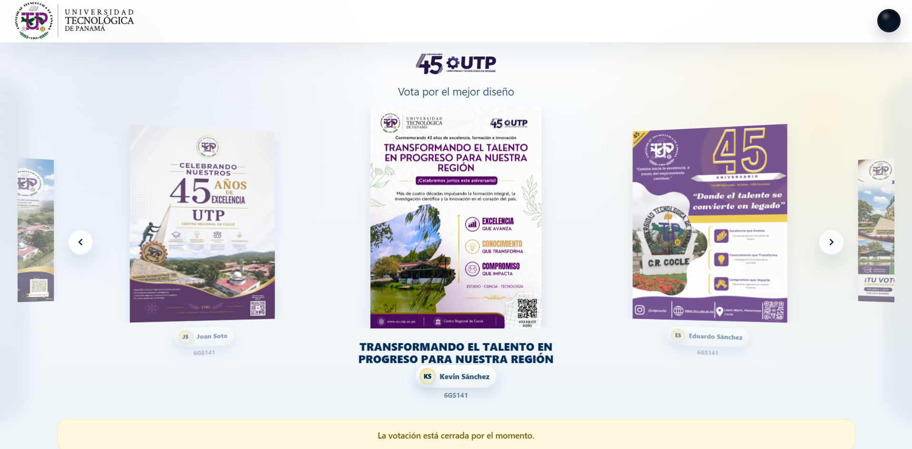

# BannerVote

A web platform to showcase banner designs and let visitors vote for their favorites. Participants receive a unique QR link to their design, making it easy to share and promote their work.

## Features

- 3D coverflow carousel for browsing designs
- Anonymous voting (one vote per visitor)
- QR sharing per banner via direct links
- Admin dashboard to manage banners and voting settings
- Responsive layout for mobile, tablet, and desktop
- Real-time updates with Firestore

## Technologies

Angular, Firebase (Authentication, Firestore, Hosting), Tailwind CSS.

### Notable libraries

- **VanillaTilt** – 3D tilt effect on the active banner card.
- **ngx-lottie** – Lottie animations for vote success feedback.
- **canvas-confetti** – Confetti burst when a vote is cast.

## Local setup

1. Clone the repository.
2. Run `npm install`.
3. Copy `src/environments/environment.example.ts` to `src/environments/environment.ts` and fill in your Firebase project credentials.
4. Run `npm run build` to generate the production bundle.
5. Install the Firebase CLI globally if you haven't: `npm install -g firebase-tools`.
6. Deploy with `firebase deploy --only hosting`.

## License

MIT
